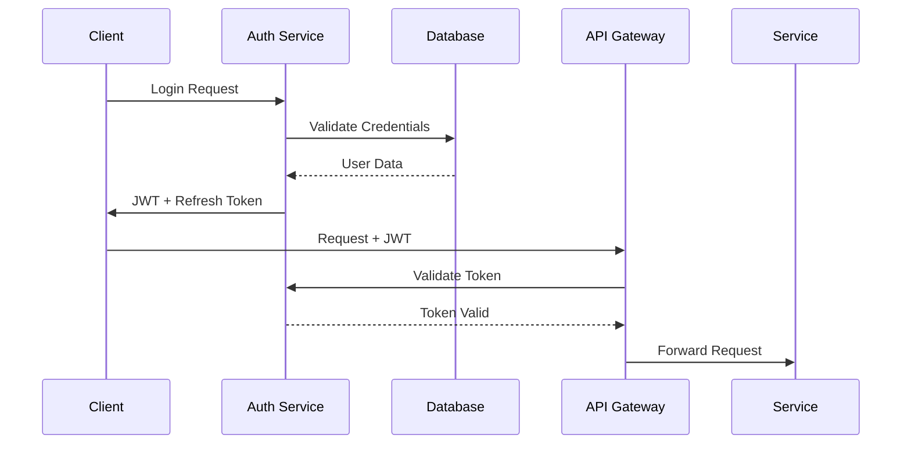

# Program Planner Enhancement Plan

## Document Information
- **Created Date**: 2026-04-10
- **Author**: Enterprise Architecture Team
- **Version**: 1.0
- **Purpose**: Comprehensive enhancement plan for JIRA integration and enterprise-scale improvements

## Executive Summary

This enhancement plan outlines the strategic transformation of the Program Planner application to integrate JIRA connectivity (Cloud and Data Center) via MCP Server, implement AI-powered insights, and scale the architecture for enterprise deployment.

## Current State Analysis

### 1. Existing Architecture Overview

#### Technology Stack
- **Frontend**: HTML5, CSS3 (Glassmorphism UI), Vanilla JavaScript
- **Backend**: Node.js with Express.js
- **Database**: SQLite (as per database_setup.md)
- **Document Generation**: Excel, PDF, PPT generators
- **Security**: Basic environment configuration (.env)

#### Current Capabilities
- Program planning and tracking
- Document generation (Excel, PDF, PowerPoint)
- Basic CRUD operations
- Simple authentication
- Responsive UI with modern glassmorphism design

#### Architecture Strengths
- Modular structure with separate concerns
- Clean separation of frontend and backend
- Document generation capabilities
- Modern UI design patterns

#### Architecture Limitations
- No external integration capabilities
- Limited scalability (SQLite database)
- No API versioning or documentation
- Basic security implementation
- No caching layer
- No message queue for async processing
- Limited error handling and logging
- No monitoring or observability

### 2. Current Project Structure

```
/
├── css/
│   └── styles.css          # Glassmorphism UI styles
├── docs/
│   └── database_setup.md   # Database documentation
├── generators/
│   ├── excel.js           # Excel generation
│   ├── pdf.js             # PDF generation
│   └── ppt.js             # PowerPoint generation
├── js/
│   ├── app.js             # Main application logic
│   ├── data.js            # Data management
│   ├── db.js              # Database operations
│   ├── steps.js           # Step management
│   └── wizard.js          # Wizard functionality
├── server.js              # Express server
├── index.html             # Main UI
└── package.json           # Dependencies
```

## Proposed Enhancements

### 1. JIRA Integration Architecture

#### 1.1 MCP Server Implementation
```
New Structure:
/mcp-server/
├── src/
│   ├── connectors/
│   │   ├── jira-cloud.js
│   │   ├── jira-datacenter.js
│   │   └── connector-factory.js
│   ├── auth/
│   │   ├── oauth2.js
│   │   ├── basic-auth.js
│   │   └── api-token.js
│   ├── middleware/
│   │   ├── rate-limiter.js
│   │   ├── cache.js
│   │   └── error-handler.js
│   └── services/
│       ├── jira-service.js
│       └── sync-service.js
```

#### 1.2 JIRA Connectivity Features
- **Multi-Instance Support**: Connect to multiple JIRA instances simultaneously
- **Authentication Methods**:
  - OAuth 2.0 for JIRA Cloud
  - Basic Auth + API Token for Data Center
  - Personal Access Tokens
- **Data Synchronization**:
  - Real-time webhook integration
  - Scheduled batch synchronization
  - Incremental updates
- **API Operations**:
  - Issue CRUD operations
  - Project management
  - Sprint planning integration
  - Custom field mapping

### 2. AI-Powered Insights Layer

#### 2.1 AI Architecture Components
```
/ai-insights/
├── src/
│   ├── models/
│   │   ├── nlp-processor.js
│   │   ├── pattern-analyzer.js
│   │   └── prediction-engine.js
│   ├── analyzers/
│   │   ├── velocity-analyzer.js
│   │   ├── risk-detector.js
│   │   ├── dependency-mapper.js
│   │   └── sentiment-analyzer.js
│   └── reports/
│       ├── insight-generator.js
│       └── recommendation-engine.js
```

#### 2.2 AI Capabilities
- **Predictive Analytics**:
  - Sprint velocity predictions
  - Delivery date forecasting
  - Risk assessment scores
- **Pattern Recognition**:
  - Bottleneck identification
  - Team performance patterns
  - Issue resolution trends
- **Natural Language Processing**:
  - Automated issue categorization
  - Sentiment analysis on comments
  - Requirement extraction
- **Intelligent Recommendations**:
  - Resource allocation suggestions
  - Priority optimization
  - Process improvement insights

### 3. Enterprise-Scale Architecture

#### 3.1 Microservices Architecture
```
Proposed Services:
├── api-gateway/           # Kong/Express Gateway
├── auth-service/          # Authentication & Authorization
├── jira-connector/        # JIRA Integration Service
├── ai-service/           # AI Insights Service
├── notification-service/  # Email/Slack/Teams
├── reporting-service/     # Advanced Reporting
└── data-service/         # Core Data Management
```

#### 3.2 Infrastructure Enhancements
- **Database Migration**:
  - From SQLite to PostgreSQL/MySQL
  - Implement connection pooling
  - Add read replicas for scaling
- **Caching Strategy**:
  - Redis for session management
  - CDN for static assets
  - API response caching
- **Message Queue**:
  - RabbitMQ/Kafka for async processing
  - Event-driven architecture
  - Reliable message delivery

#### 3.3 Security Enhancements
- **Authentication & Authorization**:
  - JWT-based authentication
  - Role-Based Access Control (RBAC)
  - Multi-Factor Authentication (MFA)
- **API Security**:
  - Rate limiting per client
  - API key management
  - Request signing
- **Data Security**:
  - Encryption at rest and in transit
  - Field-level encryption for sensitive data
  - Audit logging

### 4. DevOps & Monitoring

#### 4.1 CI/CD Pipeline
```yaml
Pipeline Stages:
- Code Quality Checks (ESLint, SonarQube)
- Unit Testing (Jest, Mocha)
- Integration Testing
- Security Scanning (OWASP)
- Container Building (Docker)
- Deployment (Kubernetes/ECS)
```

#### 4.2 Observability Stack
- **Monitoring**: Prometheus + Grafana
- **Logging**: ELK Stack (Elasticsearch, Logstash, Kibana)
- **Tracing**: Jaeger/Zipkin
- **APM**: New Relic/DataDog

## Implementation Roadmap

### Phase 1: Foundation (Weeks 1-4)
1. **Database Migration**
   - Migrate from SQLite to PostgreSQL
   - Implement data migration scripts
   - Set up connection pooling

2. **API Restructuring**
   - Implement RESTful API standards
   - Add API versioning
   - Create OpenAPI documentation

3. **Security Baseline**
   - Implement JWT authentication
   - Add basic RBAC
   - Secure environment configuration

### Phase 2: JIRA Integration (Weeks 5-8)
1. **MCP Server Development**
   - Build connector framework
   - Implement JIRA Cloud connector
   - Add JIRA Data Center support

2. **Authentication Layer**
   - OAuth 2.0 implementation
   - API token management
   - Secure credential storage

3. **Data Synchronization**
   - Webhook integration
   - Batch sync implementation
   - Conflict resolution

### Phase 3: AI Implementation (Weeks 9-12)
1. **AI Service Setup**
   - Deploy ML models
   - Implement analysis pipelines
   - Create insight APIs

2. **Pattern Analysis**
   - Velocity tracking
   - Risk detection algorithms
   - Trend analysis

3. **Reporting Enhancement**
   - AI-powered dashboards
   - Predictive reports
   - Recommendation engine

### Phase 4: Enterprise Scaling (Weeks 13-16)
1. **Microservices Migration**
   - Service decomposition
   - API Gateway setup
   - Service mesh implementation

2. **Infrastructure Setup**
   - Container orchestration
   - Load balancing
   - Auto-scaling policies

3. **Monitoring & Observability**
   - Metrics collection
   - Log aggregation
   - Distributed tracing

## Technical Specifications

### 1. Technology Stack Updates

#### Backend
```json
{
  "runtime": "Node.js 18+",
  "framework": "Express.js / Fastify",
  "database": {
    "primary": "PostgreSQL 14+",
    "cache": "Redis 7+",
    "search": "Elasticsearch 8+"
  },
  "messageQueue": "RabbitMQ / Apache Kafka",
  "authentication": "Passport.js + JWT",
  "validation": "Joi / Yup",
  "orm": "Prisma / TypeORM"
}
```

#### Frontend
```json
{
  "framework": "React 18+ / Vue 3",
  "stateManagement": "Redux Toolkit / Pinia",
  "ui": "Material-UI / Ant Design",
  "charts": "D3.js / Chart.js",
  "http": "Axios / Fetch API",
  "testing": "Jest + React Testing Library"
}
```

### 2. API Design Standards

#### RESTful Endpoints
```
GET    /api/v1/projects
POST   /api/v1/projects
GET    /api/v1/projects/{id}
PUT    /api/v1/projects/{id}
DELETE /api/v1/projects/{id}

GET    /api/v1/jira/issues
POST   /api/v1/jira/sync
GET    /api/v1/jira/projects/{key}/insights

POST   /api/v1/ai/analyze
GET    /api/v1/ai/predictions/{projectId}
GET    /api/v1/ai/recommendations/{projectId}
```

### 3. Security Requirements

#### Authentication Flow


## Risk Assessment & Mitigation

### Technical Risks
1. **Data Migration Complexity**
   - Risk: Data loss during migration
   - Mitigation: Comprehensive backup strategy, staged migration

2. **JIRA API Limitations**
   - Risk: Rate limiting, API changes
   - Mitigation: Implement caching, version abstraction

3. **AI Model Accuracy**
   - Risk: Incorrect predictions
   - Mitigation: Continuous training, human validation

### Business Risks
1. **User Adoption**
   - Risk: Resistance to new features
   - Mitigation: Phased rollout, training programs

2. **Performance Impact**
   - Risk: System slowdown
   - Mitigation: Performance testing, optimization

## Success Metrics

### Technical KPIs
- API response time < 200ms (p95)
- System uptime > 99.9%
- JIRA sync latency < 5 seconds
- AI prediction accuracy > 85%

### Business KPIs
- User adoption rate > 80%
- Time saved on reporting > 50%
- Project visibility improvement > 70%
- Decision-making speed increase > 40%

## Budget Estimation

### Development Costs
- Backend Development: 400 hours
- Frontend Development: 300 hours
- AI Implementation: 200 hours
- Testing & QA: 150 hours
- DevOps Setup: 100 hours

### Infrastructure Costs (Monthly)
- Cloud Hosting: $500-1000
- Database Services: $200-400
- AI/ML Services: $300-600
- Monitoring Tools: $100-200

## Conclusion

This enhancement plan transforms the Program Planner from a standalone application to an enterprise-grade solution with JIRA integration and AI-powered insights. The phased approach ensures minimal disruption while delivering continuous value improvements.

## Next Steps

1. **Review and approve this enhancement plan**
2. **Prioritize features for MVP**
3. **Allocate resources and budget**
4. **Begin Phase 1 implementation**
5. **Establish project governance**

---

*This document should be reviewed and updated regularly as the project progresses.*