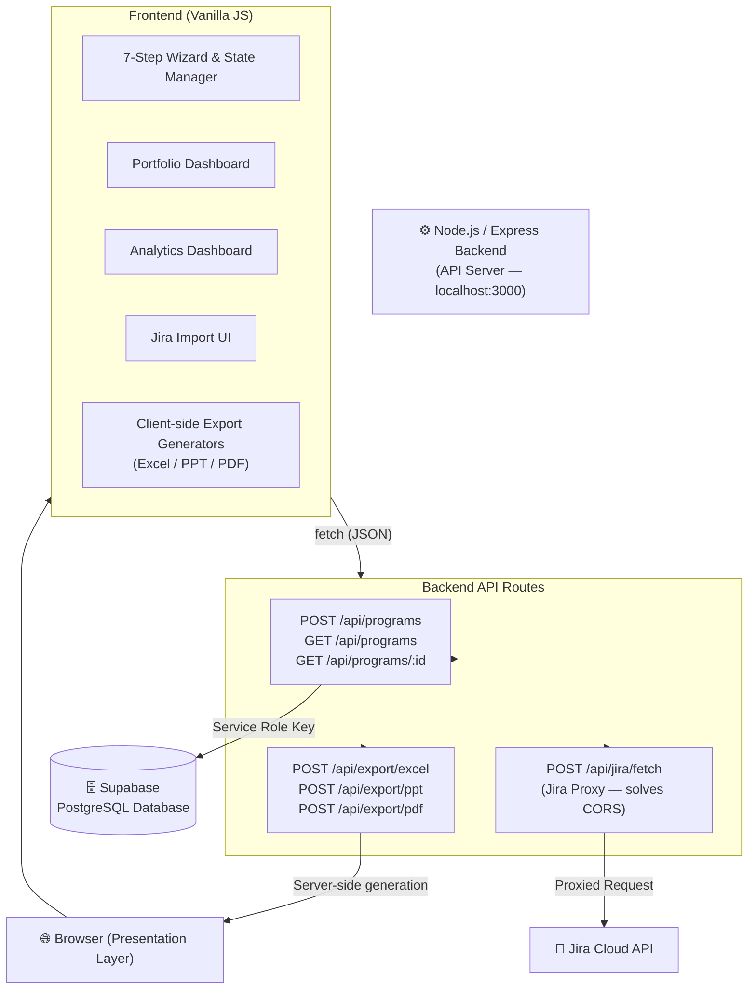

# Program Management Automation Suite


A full-stack web application for automating the creation of enterprise-grade program plans, roadmaps, and execution dossiers. Built with a secure **Node.js API backend** and a modern vanilla JS frontend, connected to a **PostgreSQL** database with **AI-powered analytics** and **JIRA integration**.

---

## 🚀 Key Features


- **10-Step Planning Wizard**: Comprehensive journey through program basics, phases, workstreams, task backlog, RAID log, stakeholder mapping, export configuration, JIRA import, and AI analysis.
- **Searchable Portfolio Dashboard**: Centralised program library with real-time search, pagination, health indicators, and progress bars.

- **Advanced JIRA Integration**: 
  - Import from JIRA via direct API (routed through backend proxy to solve CORS) or CSV file upload
  - Automatic field mapping and data extraction
  - Historical data sync with incremental updates
- **AI Sprint Analyst**: AI-powered sprint performance analysis with actionable insights
- **KPI Dashboard**: Real-time project metrics including:
  - Sprint Predictability
  - First Time Pass Rate (FTPR)
  - Defect Density
  - Regression Rate
  - Defect Leakage
  - Reopen Rate
  - Cross-project Dependencies
- **Advanced Analytics**: Chart.js powered dashboards for task distribution, resource allocation, and RAID criticality.
- **Export Suite**:
  - **MS Excel** — Multi-sheet workbook with Gantt chart (ExcelJS)
  - **MS PowerPoint** — Executive steering pack (PptxGenJS)
  - **PDF** — Formal program dossier (jsPDF + AutoTable)

- **Cloud Sync**: Explicit "Save & Sync" to PostgreSQL via backend API for full control over when data persists.
- **MCP Server Integration**: Model Context Protocol server for enhanced JIRA connectivity and AI capabilities

---

## 🏗️ Application Architecture


The application follows a **full-stack Client-Server architecture** with **AI-enhanced capabilities**. All business logic, database access, and external API calls are handled server-side by a dedicated **Node.js (Express)** backend. The browser acts as a pure **Presentation Layer** with modern JavaScript components.



### Architecture Highlights

| Concern | Design Decision |
|---|---|
| **Security** | Supabase Service Role Key never exposed to the browser. Jira credentials proxied server-side. |
| **Data Integrity** | Frontend `DB` service uses a promise-based save mutex ensuring saves execute sequentially, preventing duplicate inserts. |
| **Export** | Client-side generators for instant downloads; backend export endpoints for server-triggered generation (reports, email, etc.). |
| **State Management** | `AppData` global object on the frontend. `dbId` tracks the Supabase primary key for update vs. insert logic. |
| **Async Safety** | `Steps.render()` includes a race condition guard — stale API responses can never overwrite a newer step. |

---

## 🛠️ Technology Stack

| Layer | Technology |
|---|---|
| **Frontend** | Vanilla HTML5, CSS3 (Flex/Grid), ES6+ JavaScript |
| **Backend** | Node.js, Express.js |

| **Database** | PostgreSQL (Local/Cloud) |
| **Auth / DB Proxy** | PostgreSQL connection (server-side only) |
| **Excel** | ExcelJS (CDN + npm) |
| **PowerPoint** | PptxGenJS (CDN + npm) |
| **PDF** | jsPDF + jsPDF-AutoTable (CDN + npm) |
| **Analytics** | Chart.js (CDN) |
| **AI Integration** | OpenAI API for Sprint Analysis |
| **JIRA Integration** | JIRA Cloud API with OAuth2 |
| **CSV Parsing** | SheetJS / xlsx (CDN) |

---

## 📦 Getting Started

### npm Scripts

This project uses npm scripts as the unified command interface. All commands should be run from the project root.

| Command | Description |
|---|---|
| `npm install` | Install all dependencies (run once after cloning) |
| `npm start` | Start the backend server in **production** mode using `node` |
| `npm run dev` | Start the backend in **development** mode using `nodemon` — auto-restarts on file save |

> **Why `nodemon`?**  
> During development, any change to `server.js` or `server/generators.js` requires a server restart. `nodemon` watches for file changes and restarts automatically, removing manual interruptions and making the dev loop significantly faster. It is listed under `devDependencies` and is **not** installed in production.

### Prerequisites

- **Node.js** v18+ and **npm** ([nodejs.org](https://nodejs.org))
- **Git**
- **PostgreSQL** v14+ (local or cloud instance)
- **JIRA Cloud** account (for JIRA integration)
- **OpenAI API Key** (for AI Sprint Analyst)

### 1. Clone the Repository

```bash
git clone https://github.com/satyasgit/Program_Planner.git
cd Program_Planner
```

### 2. Install Backend Dependencies

```bash
npm install
```

### 3. Configure Environment Variables

Create a `.env` file in the project root (this file is gitignored and never committed):

```bash
# .env
PORT=3000

# PostgreSQL Database
PG_HOST=localhost
PG_PORT=5432
PG_DATABASE=program_planner
PG_USER=your_db_user
PG_PASSWORD=your_db_password

# JIRA Integration
JIRA_CLOUD_URL=https://your-domain.atlassian.net
JIRA_API_TOKEN=your_jira_api_token
JIRA_USER_EMAIL=your_email@company.com

# AI Integration
OPENAI_API_KEY=your_openai_api_key

# MCP Server (Optional)
MCP_SERVER_PORT=3001
```

> **Where to find these:**
> - **PostgreSQL**: Use your local PostgreSQL installation or cloud provider credentials
> - **JIRA API Token**: Go to [Atlassian Account Settings](https://id.atlassian.com/manage-profile/security/api-tokens)
> - **OpenAI API Key**: Get from [OpenAI Platform](https://platform.openai.com/api-keys)

### 4. Set Up the Database

Run the database migrations:

```bash
# Run all migrations
npm run migrate

# Or manually run migrations
cd database
node run-migrations.js
```

The migrations will create all necessary tables including:
- `users` - User management
- `projects` - Project metadata
- `programs` - Main program data
- `steps` - Wizard step data
- `jira_sync_tracking` - JIRA synchronization tracking

### 5. Start the Backend Server

```bash
# Production mode
npm start

# Development mode (with auto-restart)
npm run dev
```

You should see:
```
🚀 Program Planner Backend running on http://localhost:3000
✅ PostgreSQL connection established
📊 KPI endpoints ready
🤖 AI Sprint Analyst ready
```

### 6. (Optional) Start MCP Server

For enhanced JIRA integration:

```bash
cd mcp-server
npm install
npm start
```

### 6. Open the Application

Open `index.html` directly in your browser, or serve it with a simple server:

```bash
# Python (Mac/Linux)
python3 -m http.server 8080

# Python (Windows)
python -m http.server 8080
```

Then open [http://localhost:8080](http://localhost:8080).

> **Important**: The Node.js backend (`node server.js`) **must be running** before you open the app. The frontend makes `fetch` calls to `http://localhost:3000/api/...`.

---

## 📂 Project Structure

```
Program_Planner_High_Level/
├── server.js                  # Express API server (entry point)
├── server/
│   └── generators.js          # Server-side Excel, PPT, PDF generators
├── package.json               # Node.js dependencies
├── .env                       # Secrets — NOT committed to git
├── .gitignore
├── index.html                 # Frontend entry point
├── kpi-dashboard-page.html    # KPI Dashboard page
├── ai-sprint-analyst.html     # AI Sprint Analyst page
├── analytics.html             # Analytics Dashboard
├── css/
│   ├── styles.css             # Application styles & design system
│   └── kpi-dashboard.css      # KPI Dashboard styles
├── js/
│   ├── app.js                 # Bootstrap & event delegation
│   ├── wizard.js              # Wizard engine, navigation, state reset
│   ├── steps.js               # Step renderers, validation, Jira import
│   ├── data.js                # AppData schema & sample data
│   ├── db.js                  # Frontend API proxy (fetch → Node.js)
│   ├── kpi-calculator.js      # KPI calculation logic
│   ├── kpi-dashboard.js       # KPI Dashboard functionality
│   ├── jira-field-sync.js     # JIRA field synchronization
│   ├── components/            # JavaScript components
│   │   ├── KpiDashboard.js    # KPI Dashboard component
│   │   └── ErrorBoundary.js   # Error handling component
│   └── generators/            # Client-side export logic
│       ├── excel.js
│       ├── ppt.js
│       └── pdf.js
├── database/
│   ├── migrations/            # SQL migration files
│   ├── pg-connection.js       # PostgreSQL connection
│   └── run-migrations.js      # Migration runner
├── mcp-server/                # Model Context Protocol server
│   ├── server.js              # MCP server entry point
│   ├── connectors/
│   │   └── jira-connector.js  # JIRA API connector
│   └── middleware/
│       └── auth.js            # Authentication middleware
├── config/
│   └── jira-field-mappings.json  # JIRA field configuration
└── docs/
    ├── database_setup.md      # Database setup guide
    └── KPI_IMPLEMENTATION_SUMMARY.md  # KPI implementation details
```

---

## 🔧 Troubleshooting

### 🪟 Windows

| Issue | Fix |
|---|---|
| `npm` not recognised | Install Node.js from [nodejs.org](https://nodejs.org) and restart your terminal |
| `npm : File cannot be loaded because running scripts is disabled` | Open PowerShell **as Administrator** and run: `Set-ExecutionPolicy RemoteSigned -Scope CurrentUser` |
| Port 3000 already in use | Change `PORT=3001` in `.env`, then update `API_BASE` in `js/db.js` to match |
| `fetch` to localhost fails | Make sure `node server.js` is running in a separate terminal before opening the app |
| Git commit fails with special characters | Wrap commit messages in double quotes, avoid colons in the message |

### 🍎 Mac / Linux

| Issue | Fix |
|---|---|
| `node` not found | Install Node.js via [nodejs.org](https://nodejs.org) or `brew install node` |
| Permission denied on `npm install` | Never use `sudo npm install`. Fix npm permissions: `npm config set prefix ~/.npm-global` |
| Port 3000 in use | Run `lsof -i :3000` to find the process, then `kill -9 <PID>`, or change the PORT in `.env` |
| CORS error in browser console | The browser must call the local Node.js backend, not Supabase directly. Ensure `server.js` is running |
| `python3` not found for serving frontend | Use `npx serve .` instead of Python |

### 🌐 General

| Issue | Fix |
|---|---|
| Dashboard shows no programs | Check PostgreSQL connection in `.env` and ensure migrations have been run |
| Programs are not saving | Open browser DevTools (F12) → Network tab → check for failed requests to `localhost:3000/api/programs` |
| JIRA import fails | Ensure your JIRA URL is the full base URL (e.g. `https://yourcompany.atlassian.net`), API token is valid, and user has necessary permissions |
| Dates reset after reload | Ensure you click "Save & Sync to Cloud" before navigating away from the program |
| Export files not downloading | Check browser popup/download permissions; some corporate browsers block auto-downloads |

---

---

## 🆕 Recent Updates (Version 2.0.0)

### Major Features Added:

1. **KPI Dashboard**
   - Real-time calculation of 6 key performance indicators
   - Historical trend analysis with interactive charts
   - Cross-project dependency visualization
   - Automated data extraction from JIRA

2. **AI Sprint Analyst**
   - AI-powered sprint performance analysis
   - Actionable insights and recommendations
   - Historical analysis storage
   - Integration with OpenAI GPT-4

3. **Enhanced JIRA Integration**
   - Extensible field mapping system
   - Incremental data synchronization
   - Custom field support
   - Automatic KPI calculation from JIRA data

4. **MCP Server**
   - Model Context Protocol implementation
   - Enhanced JIRA connectivity
   - WebSocket support for real-time updates
   - Middleware for authentication and caching

5. **Database Improvements**
   - PostgreSQL migration from Supabase
   - New tables for JIRA sync tracking
   - Optimized indexes for performance
   - Support for JSON/JSONB fields

### Technical Improvements:

- **Error Handling**: Comprehensive error boundaries and logging
- **Performance**: Optimized data fetching and caching strategies
- **Security**: Enhanced authentication and API key management
- **Scalability**: Modular architecture for easy feature additions
- **Documentation**: Extensive inline documentation and guides

---

## � Roadmap

### Phase 3 (Next Sprint):
- [ ] Advanced AI capabilities for predictive analytics
- [ ] Real-time collaboration features
- [ ] Mobile-responsive design
- [ ] Integration with Microsoft Teams and Slack
- [ ] Advanced reporting and custom KPI builder
- [ ] Multi-language support

### Phase 4 (Future):
- [ ] Machine learning for resource optimization
- [ ] Blockchain for audit trails
- [ ] AR/VR visualization for complex programs
- [ ] Voice-activated program management

---

## �📄 License

Internal Property — Designed for Program Management Professionals.

---

## 🤝 Contributing

For internal contributors:
1. Create a feature branch from `main`
2. Follow the coding standards in `CONTRIBUTING.md`
3. Ensure all tests pass
4. Submit a pull request with detailed description

---

## 📞 Support

For issues or questions:
- Internal Teams: #program-planner-support
- Email: program-planner@company.com
- Documentation: [Internal Wiki](https://wiki.company.com/program-planner)
