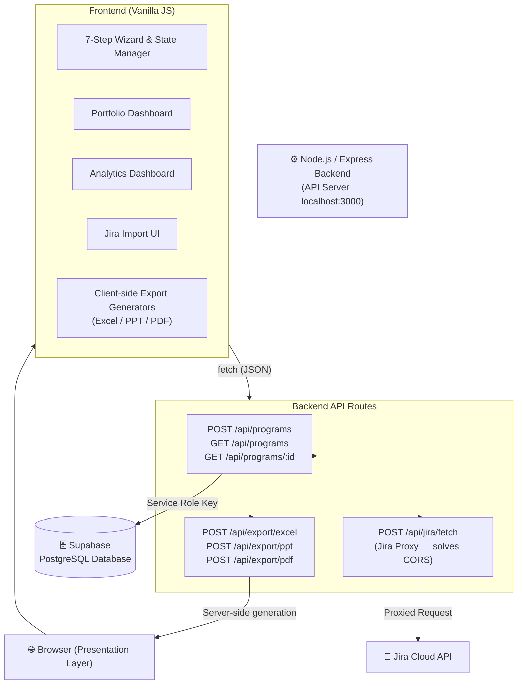

# Program Management Automation Suite

A full-stack web application for automating the creation of enterprise-grade program plans, roadmaps, and execution dossiers. Built with a secure **Node.js API backend** and a modern vanilla JS frontend, connected to a **Supabase (PostgreSQL)** cloud database.

---

## 🚀 Key Features

- **7-Step Planning Wizard**: Guided journey through program basics, phases, workstreams, task backlog, RAID log, stakeholder mapping, and export configuration.
- **Searchable Portfolio Dashboard**: Centralised program library with real-time search, pagination, health indicators, and progress bars.
- **Jira Integration**: Import from Jira via direct API (routed through backend proxy to solve CORS) or CSV file upload.
- **Advanced Analytics**: Chart.js powered dashboards for task distribution, resource allocation, and RAID criticality.
- **Export Suite**:
  - **MS Excel** — Multi-sheet workbook with Gantt chart (ExcelJS)
  - **MS PowerPoint** — Executive steering pack (PptxGenJS)
  - **PDF** — Formal program dossier (jsPDF + AutoTable)
- **Cloud Sync**: Explicit "Save & Sync" to Supabase via backend API for full control over when data persists.

---

## 🏗️ Application Architecture

The application follows a **full-stack Client-Server architecture**. All business logic, database access, and external API calls are handled server-side by a dedicated **Node.js (Express)** backend. The browser acts as a pure **Presentation Layer**.



### Architecture Highlights

| Concern | Design Decision |
|---|---|
| **Security** | Supabase Service Role Key never exposed to the browser. Jira credentials proxied server-side. |
| **Data Integrity** | Frontend `DB` service uses a promise-based save mutex ensuring saves execute sequentially, preventing duplicate inserts. |
| **Export** | Client-side generators for instant downloads; backend export endpoints for server-triggered generation (reports, email, etc.). |
| **State Management** | `AppData` global object on the frontend. `dbId` tracks the Supabase primary key for update vs. insert logic. |
| **Async Safety** | `Steps.render()` includes a race condition guard — stale API responses can never overwrite a newer step. |

---

## 🛠️ Technology Stack

| Layer | Technology |
|---|---|
| **Frontend** | Vanilla HTML5, CSS3 (Flex/Grid), ES6+ JavaScript |
| **Backend** | Node.js, Express.js |
| **Database** | Supabase (PostgreSQL) |
| **Auth / DB Proxy** | Supabase Service Role Key (server-side only) |
| **Excel** | ExcelJS (CDN + npm) |
| **PowerPoint** | PptxGenJS (CDN + npm) |
| **PDF** | jsPDF + jsPDF-AutoTable (CDN + npm) |
| **Analytics** | Chart.js (CDN) |
| **CSV Parsing** | SheetJS / xlsx (CDN) |

---

## 📦 Getting Started

### npm Scripts

This project uses npm scripts as the unified command interface. All commands should be run from the project root.

| Command | Description |
|---|---|
| `npm install` | Install all dependencies (run once after cloning) |
| `npm start` | Start the backend server in **production** mode using `node` |
| `npm run dev` | Start the backend in **development** mode using `nodemon` — auto-restarts on file save |

> **Why `nodemon`?**  
> During development, any change to `server.js` or `server/generators.js` requires a server restart. `nodemon` watches for file changes and restarts automatically, removing manual interruptions and making the dev loop significantly faster. It is listed under `devDependencies` and is **not** installed in production.

### Prerequisites

- **Node.js** v18+ and **npm** ([nodejs.org](https://nodejs.org))
- **Git**
- A **Supabase** project — [supabase.com](https://supabase.com)

### 1. Clone the Repository

```bash
git clone https://github.com/satyasgit/Program_Planner.git
cd Program_Planner
```

### 2. Install Backend Dependencies

```bash
npm install
```

### 3. Configure Environment Variables

Create a `.env` file in the project root (this file is gitignored and never committed):

```bash
# .env
PORT=3000
SUPABASE_URL=https://your-project-ref.supabase.co
SUPABASE_SERVICE_KEY=your-service-role-key-here
```

> **Where to find these:**
> - Go to your Supabase project → **Settings → API**
> - `SUPABASE_URL` = Project URL
> - `SUPABASE_SERVICE_KEY` = `service_role` secret key (not the `anon` key)

### 4. Set Up the Database

Run the SQL schema in your Supabase project:

1. Open your Supabase project → **SQL Editor**
2. Copy and paste the schema from [`docs/database_setup.md`](docs/database_setup.md)
3. Click **Run**

### 5. Start the Backend Server

```bash
node server.js
```

You should see:
```
🚀 Program Planner Backend running on http://localhost:3000
```

### 6. Open the Application

Open `index.html` directly in your browser, or serve it with a simple server:

```bash
# Python (Mac/Linux)
python3 -m http.server 8080

# Python (Windows)
python -m http.server 8080
```

Then open [http://localhost:8080](http://localhost:8080).

> **Important**: The Node.js backend (`node server.js`) **must be running** before you open the app. The frontend makes `fetch` calls to `http://localhost:3000/api/...`.

---

## 📂 Project Structure

```
Program_Planner_High_Level/
├── server.js                  # Express API server (entry point)
├── server/
│   └── generators.js          # Server-side Excel, PPT, PDF generators
├── package.json               # Node.js dependencies
├── .env                       # Secrets — NOT committed to git
├── .gitignore
├── index.html                 # Frontend entry point
├── css/
│   └── styles.css             # Application styles & design system
├── js/
│   ├── app.js                 # Bootstrap & event delegation
│   ├── wizard.js              # Wizard engine, navigation, state reset
│   ├── steps.js               # Step renderers, validation, Jira import
│   ├── data.js                # AppData schema & sample data
│   ├── db.js                  # Frontend API proxy (fetch → Node.js)
│   └── generators/            # Client-side export logic
│       ├── excel.js
│       ├── ppt.js
│       └── pdf.js
└── docs/
    └── database_setup.md      # SQL schema & Supabase setup guide
```

---

## 🔧 Troubleshooting

### 🪟 Windows

| Issue | Fix |
|---|---|
| `npm` not recognised | Install Node.js from [nodejs.org](https://nodejs.org) and restart your terminal |
| `npm : File cannot be loaded because running scripts is disabled` | Open PowerShell **as Administrator** and run: `Set-ExecutionPolicy RemoteSigned -Scope CurrentUser` |
| Port 3000 already in use | Change `PORT=3001` in `.env`, then update `API_BASE` in `js/db.js` to match |
| `fetch` to localhost fails | Make sure `node server.js` is running in a separate terminal before opening the app |
| Git commit fails with special characters | Wrap commit messages in double quotes, avoid colons in the message |

### 🍎 Mac / Linux

| Issue | Fix |
|---|---|
| `node` not found | Install Node.js via [nodejs.org](https://nodejs.org) or `brew install node` |
| Permission denied on `npm install` | Never use `sudo npm install`. Fix npm permissions: `npm config set prefix ~/.npm-global` |
| Port 3000 in use | Run `lsof -i :3000` to find the process, then `kill -9 <PID>`, or change the PORT in `.env` |
| CORS error in browser console | The browser must call the local Node.js backend, not Supabase directly. Ensure `server.js` is running |
| `python3` not found for serving frontend | Use `npx serve .` instead of Python |

### 🌐 General

| Issue | Fix |
|---|---|
| Dashboard shows no programs | Check that `SUPABASE_URL` and `SUPABASE_SERVICE_KEY` in `.env` are correct and the database schema has been applied |
| Programs are not saving | Open browser DevTools (F12) → Network tab → check for failed requests to `localhost:3000/api/programs` |
| Jira import fails | Ensure your Jira URL is the full base URL (e.g. `https://yourcompany.atlassian.net`), not an issue URL |
| Dates reset after reload | Ensure you click "Save & Sync to Cloud" before navigating away from the program |
| Export files not downloading | Check browser popup/download permissions; some corporate browsers block auto-downloads |

---

## 📄 License

Internal Property — Designed for Program Management Professionals.
